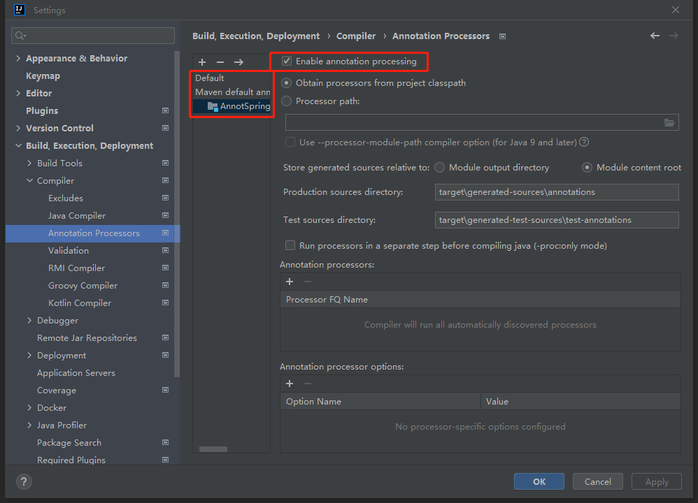

# 代码耗时计时器（v1.0）

### 简介
通过注解、标志性的 JAVA statement 进行静态注入代码，计算方法、JAVA 块的耗时，并以树形结构的形式进行展现
### 类定义

| 包名                        | 类名                  | 说明               |
|---------------------------|---------------------|------------------|
| cn.com.datu.ppa.constant  | Constant            | 基本通用的常量          |
| cn.com.datu.ppa.processor | TimerAnnotProcessor | Timer的注解处理启动器    |
| cn.com.datu.ppa.timer     | *                   | Timer注解的实际编译变更逻辑 |

cn.com.datu.ppa.timer:

| 类名                     | 说明                | 设计逻辑                                       |
|------------------------|-------------------|--------------------------------------------|
| AbstractTimerProcessor | Timer 通用方法、成员变量封装 | 对子集的一些重复代码进行封装，使用继承方法进行方法、成员变量设计的共享        |
| BlockTimerProcessor    | Block 块的处理方案      | 用于对 Block 方式的解析与静态注入变更调整                   |
| TimerProcessor         | Timer 注解的处理方案     | 用于对使用 @Timer 的方法进行代码静态注入调整                 |
| TimeCalculate          | Timer实际执行代码       | 做层级间的代理向下进行 Timer 的创建，实际展示的时候，依照层级进行链路结果构建 |


### 引入方式
加入pom依赖
```
<dependency>
    <groupId>cn.com.datu</groupId>
    <artifactId>pip-timer-annot</artifactId>
</dependency>
```

### 效果展示
```
2022-05-09 09:42:00.620 INFO  [appName] [127.0.0.1:8080] [Timer Thread-5] timer.com.weiss.util.ppa.TimeCalculate : >>>Timer report<<<
===>thread name <http-nio-8080-exec-6>
===>output time 09:42:00.612
===>timer detail
---> stage<test1 entry> track total time: 108.3804ms
   ---> stage<stackFunction> time: 108.31ms proportion: 99.94%
      ---> stage<repeat test> time: 108.24ms proportion: 99.93%
         ---> stage<execute functionOfDefault> time: 3.36ms proportion: 3.11%
            ---> stage<default execute> time: 2.17ms proportion: 64.60%
               ---> stage<getInt> time: 1.10ms proportion: 50.67%
               ---> stage<getInt> time: 223.60μs proportion: 10.30%
               ---> stage<getInt> time: 123.00μs proportion: 5.66%
               ---> stage<getInt> time: 86.30μs proportion: 3.97%
               ---> stage<getInt> time: 6.60μs proportion: 0.30%
         ---> stage<Stack execute> time: 104.86ms proportion: 96.87%
            ---> stage<load data> time: 197.70μs proportion: 0.19%
            ---> stage<load data> time: 102.40μs proportion: 0.10%
            ---> stage<load data> time: 208.90μs proportion: 0.20%
            ---> stage<load data> time: 9.00μs proportion: 0.01%
            ---> stage<load data> time: 3.90μs proportion: 0.00%
            ---> stage<stack option> time: 4.40μs proportion: 0.00%
               ---> stage<real stack option> time: 2.70μs proportion: 61.36%
            ---> stage<real stack option> time: 1.30μs proportion: 0.00%
            ---> stage<stack option> time: 2.30μs proportion: 0.00%
               ---> stage<real stack option> time: 1000.00ns proportion: 43.48%
            ---> stage<get result> time: 104.26ms proportion: 99.43%
```

### 使用方式
1. 在方法上使用 @Timer 的方式进行注解

使用样例如下:
```
@Override
@Timer("test2 entry") // 计时器名称为 test2 entry
public void doTest2() throws InterruptedException, ExecutionException {
    ...
}

@Timer // 计时器名称为 doDepth1
private void doDepth1(Random random) throws InterruptedException {
    ...
}

private String DATA = "data"

private String getData() {
    return "getData";
}

@Timer("doDepth ${DATA}") // 计时器名称为 doDepth data
private void doDepth1(Random random) throws InterruptedException {
    ...
}

@Timer("doDepth #{getData()}") // 计时器名称为 doDepth getData
private void doDepth1(Random random) throws InterruptedException {
    ...
}

@Timer("doDepth${DATA}#{getData()}") // 计时器名称为 doDepthdatagetData
private void doDepth1(Random random) throws InterruptedException {
    ...
}
```
> 使用说明
> 1. @Timer 只有个一个字段 String value, 当 value == null 或 value.empty() 时，计时器将会使用注解所对应的方法名作为计时器名称，其他情况则使用 value 的值作为计时器名称
> 2. @Timer 当前不支持接口方法、抽象方法的注解实现，且不支持方法重写等继承，以上做法，都有可能导致编译报错、计时器异常等问题
> 3. @Timer value 中支持使用变量、函数调用，具体请参考样例

2. 在需要启用代码块耗时器的类或方法上使用 @BlockTimerEnable, 在方法中使用代码块，代码块内调用 TimeCalculate.block(String) 方法

使用样例如下:
```
private String DATA = "data"

private String getData() {
    return "getData";
}

@BlockTimerEnable
private void stackFunction() throws InterruptedException {
    TimeCalculate.block("repeat test"); // 第一个计时器，名称为 repeat test
    ...
    {
        TimeCalculate.block("execute functionOfDefault"); // 第二个计时器，名称为 execute functionOfDefault
        TimeCalculate.block("execute functionOfDefault2"); // 无效的计时器
        ...
        TimeCalculate.block("execute functionOfDefault3"); // 无效的计时器
        {
            TimeCalculate.block("execute" + DATA + getData()); // 第三个计时器，名称为 executedatagetData
            ...
        }
        {
            TimeCalculate.block("execute " + DATA + " " + getData()); // 第四个计时器，名称为 execute data getData
            ...
        }
        {
            TimeCalculate.block("execute ${DATA} #{getData()}"); // 第五个计时器，名称为 execute data getData
            ...
        }
        ...
        // 支持的 lambda 表达式样例
        strList.stream().filter((obj)->{
            TimeCalculate.block("lamda test");
            return true;
        });

        // 支持的 lambda 表达式样例
        List<String> set = strList.stream().sorted(String::compareTo).filter((obj)->{
            System.out.println("1234567");
            TimeCalculate.block("lamda test1");
            return new Random().nextBoolean();
        }).collect(Collectors.toList());
        
        // 支持的 lambda 表达式样例
        Predicate obj2 = (object) -> {
                TimeCalculate.block("lamda test");
                return true;
        };
        
        // 异步的表达式样例
        Thread thread = this.currentThread();
        CompletableFuture.runAsync(()->{
            TimeCalculate.block("lamda test");
            System.out.println("1234567");
        });
        
        // 不支持的匿名内部类表达式样例
        Predicate obj = new Predicate<String>() {
            @Override
            public boolean test(String s) {
                TimeCalculate.block("lamda test");
                return true;
            }
        };
    }
    ...
}
```
> 使用说明
> 1. @BlockTimerEnable 注解可作用与类和方法上
> 2. 当 @BlockTimerEnable 注解在类上的时候要对单独的类做排除的话，
> 可以对单一的方法使用注解 @BlockTimerEnable(enable = false)，以去除该方法的静态注入
> 3. 计时器的名称为调用 TimeCalculate.block 方法所传递的参数 
> 4. 当一个代码块中存在多个 block 方法调用的时候只有第一个 block 会生效
> 5. 当前版本不支持匿名内部类、lambda表达式的变量定义使用方式，但支持参数 lambda 表达式的注入
> 6. @BlockTimerEnable 当前不支持接口方法、抽象方法的注解实现，
> 且不支持方法重写等继承，以上做法，部分可用，但没有做测试，会有可能导致编译报错、计时器异常等问题
> 7. @TimeCalculate.block value 中支持使用变量(${XXX})、函数调用(${XXX})，且支持 ‘+’ 方式表达的部分动态拼接，具体请参考样例

### 使用特性、限制
 1. 计时器默认状态为不开启状态，需要在初始化过程中，调用方法 TimeCalculate.open() 以开启该计时器的计算及展示
    同时，若要关闭该计时器，可调用方法 TimeCalculate.close()
 2. ***设计的使用理念为***
    1. 系统内统一使用 @Timer 获取方法调用的耗时
    2. 当遇到外部方法调用的情况下，使用 TimeCalculate.block 对指定代码块进行耗时的获取
    3. 当遇到需要判断部分代码耗时时，尽可能的将块只包含所需要内部代码逻辑
    4. 尽可能的，不添加计时器到 for 循环中，大量的循环会导致大量的计时器类创建且短时间无法销毁，由于计时器类的释放，仅在当前调用所有计时器完成后才会进行销毁
 3. 由于注解使用的方案为静态注入，所以排除计时器本身的性能消耗，不会对代码有额外的性能损耗，但相应的会导致延长编译期的时长
 4. 树形结构的树形节点排列只依照计时器本身的规则进行排列，并非依照代码树形结构为准（当当前计时器节点计算未完成时触发了下一个计时器启动，即认为两个计时器所属关系为父子节点关系）
    尽可能的使用 @Timer 而非 TimeCalculate.block 可以极大大程度的规避树形结构排列问题


> Q&A
> 1. IDEA 编译后没有计时器的静态注入
>    
>    如图开启以下配置
>
>    设置路径为：File->Settings->Build, Execution, Deployment->Compiler->Annotation Processors
>
>    任意选择：统一默认修改或指定项目(需要的编译的项目)，查看 Enable annotation processing 选项，然后将其勾选，其余配置不做调整(若存在实际变更与原始配置不一致，请根据场景，变更配置，将该 jar 包进行导入)
>    
>    
> 2. 找不到 tools.jar
> 
>    系统环境变量中添加 JAVA_HOME 其对应路径应为 JDK 对应路径例如 C:/XX/jdk1.8.0_201/
